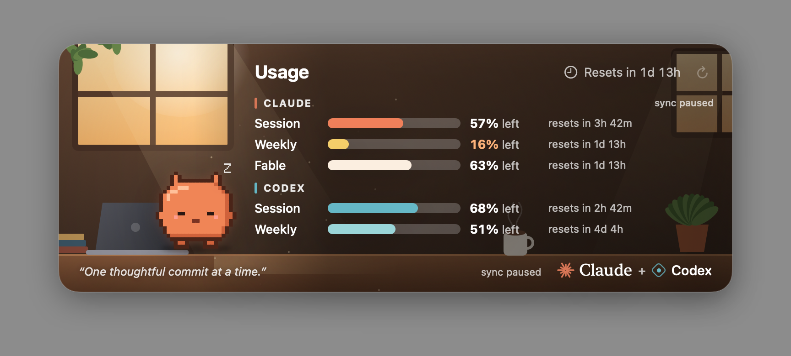
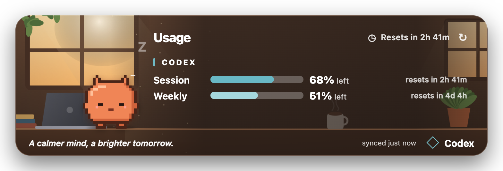

# Quota Nook

An unofficial pixel-art quota widget with a coffee-room scene that changes
through morning, afternoon, and evening.

- **macOS:** Claude (Session, Weekly, Fable) and Codex (Session, Weekly).
- **Windows x64:** Codex (Session, Weekly). Claude is not implemented in this
  edition because its macOS Keychain integration is not portable to Windows.

Both editions show the time remaining until reset, not just a calendar date.





## macOS — Claude + Codex

The [macOS source](macos/) needs macOS 14 or newer and Xcode Command Line Tools.
Run `cd macos && ./build.sh`; the app is written to `macos/dist/Quota Nook.app`.
Sign in to Claude Code and Codex locally with your own accounts. No credentials
are included in this repository. The app's startup toggle creates a per-user
LaunchAgent; the build script does not install or enable it automatically.

**Claude integration is experimental.** It reads Claude Code's OAuth credential
from the local macOS Keychain and sends it only to Anthropic's usage endpoint to
read subscription limits. That endpoint is not a documented third-party quota
API and may change or stop working. It does not make model requests, export the
token, or write the token to the app's cache. Anthropic [recommends API-key
authentication for third-party tools](https://support.claude.com/en/articles/13189465-log-in-to-your-claude-account),
but API usage is not the same as Claude subscription quota. Review the source
and applicable terms before running this integration. You can use the Windows
Codex-only edition if you do not want it.

The macOS build uses ad-hoc signing, not Apple notarization. macOS may block
an app downloaded from someone else. Build it locally from source if desired.

## Windows x64 — Codex only

1. Install the [Codex CLI](https://developers.openai.com/codex/cli/) and sign in
   with your own ChatGPT account (`codex login`). Check that `codex` runs in a
   terminal before opening the widget.
2. Download the Windows x64 ZIP from [Releases](../../releases), extract the
   **whole** ZIP, and run `Quota Nook.exe`.
3. Click the tray icon to show the card. Right-click it to refresh, choose a
   background, enable startup with Windows, or quit. Hover near the top-center
   of the screen to reveal the card.

If Codex is installed in a nonstandard location, set `CODEX_CLI_PATH` to the
full path of `codex.exe` or `codex.cmd`, then restart Quota Nook. It reads usage
through the locally installed Codex CLI's `account/rateLimits/read` app-server
method. Your own CLI installation and login are required; no account or
credentials are included. The last reading is cached in Electron's per-user
app data directory so the card can show it while offline. There is no telemetry
in this project.

The portable build is unsigned and was cross-packaged on macOS. It has **not
been launch-tested on a Windows PC**. Windows may show a SmartScreen warning;
only run software you trust. Please report Windows-specific problems in Issues.

## Build the Windows edition from source

Requires Node.js and npm. From `windows/`:

```sh
npm install
npm start
npm run pack:win
```

`pack:win` writes a portable folder under `dist/`; ZIP that folder to share it.

## Scope and license

This repository contains source and original pixel-art assets but no OAuth
credentials, local caches, personal paths, or development scripts. The source
and assets here are MIT-licensed; provider names remain their owners'
trademarks. Quota Nook is an independent community project, not affiliated with
or endorsed by OpenAI or Anthropic.
